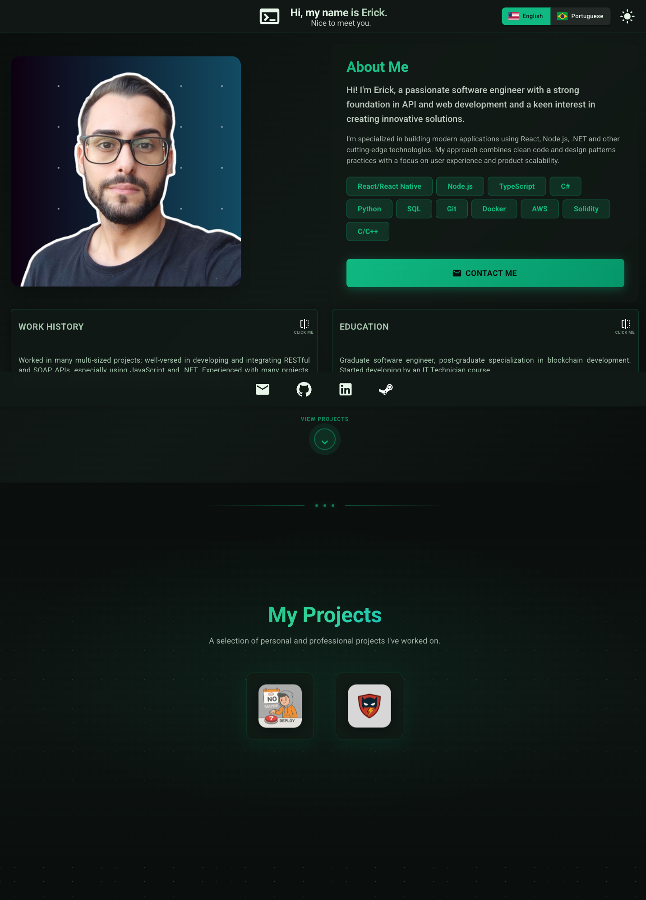

# Erick Pacheco | Portfolio

A modern, responsive personal portfolio website showcasing my work as a software engineer. Built with React 19 and featuring a glassmorphic design aesthetic with dark/light theme support and multilingual capabilities.



## Features

- **Responsive Design**: Optimized for desktop and mobile devices with adaptive layouts
- **Theme Support**: Dark and light mode with smooth transitions and localStorage persistence
- **Multilingual**: Full support for English and Portuguese with easy language switching
- **Interactive Cards**: Flippable cards showcasing work history and education details
- **Projects Showcase**: Icon-based project gallery with hover tooltips
- **Glassmorphic UI**: Modern aesthetic with blur effects, gradients, and subtle animations
- **Animated Elements**: Typewriter text effect, bounce animations, and smooth transitions

## Tech Stack

| Category | Technologies |
|----------|-------------|
| Framework | React 19, Vite |
| UI Library | Material-UI (MUI) v7 |
| Styling | Emotion, CSS-in-JS |
| Routing | React Router v7 |
| Responsive | react-responsive |
| Deployment | GitHub Pages (gh-pages) |

## Getting Started

### Prerequisites

- Node.js 18+
- Yarn 4.x

### Installation

```bash
# Clone the repository
git clone https://github.com/rckmath/rckmath.github.io.git
cd rckmath.github.io

# Install dependencies
yarn install

# Start development server
yarn dev
```

### Available Scripts

| Command | Description |
|---------|-------------|
| `yarn dev` | Start development server |
| `yarn build` | Create production build |
| `yarn preview` | Preview production build locally |
| `yarn lint` | Run ESLint with zero warnings tolerance |
| `yarn deploy` | Build and deploy to GitHub Pages |

## Project Structure

```
src/
├── components/          # Reusable UI components
│   ├── AboutMeContent/  # Bio, skills, contact button
│   ├── Header.jsx       # Sticky header with typewriter effect
│   ├── Footer.jsx       # Social links footer
│   ├── MainCard/        # Flippable info cards
│   ├── ProjectsSection/ # Project showcase gallery
│   └── ScrollIndicator/ # Animated scroll button
├── context/             # React context providers (Theme, Language)
├── pages/               # Page components
├── translations/        # i18n files (en.js, pt.js)
├── theme.js             # MUI theme configuration
└── App.jsx              # Main application component
```

## License

This project is licensed under the terms of the CC0 1.0 Universal license. See the [LICENSE](LICENSE) file for details.
